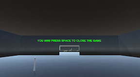

# Introduction

I am a 22 year old programmer that enjoys writing code for gaming projects as well as creating models using blender.
I enjoy learning new ways to produce an outcome as well as experimenting with my own methods to see if I can produce a better way.

## Interests

I am interested in all things game including both code and design as i also really enjoy drawing which allows me to easily create quick models from my drawings in blender.

### Current Projects

*   First Person Puzzle Game(University Work) - [Groupwork](https://github.com/Ragnar-Dragonson/groupwork)

*   Procedural Cave Generation(Final Year University Work TBC) -
*   Norse Invasion Scene (TBC) -

## Thank You For Visiting

